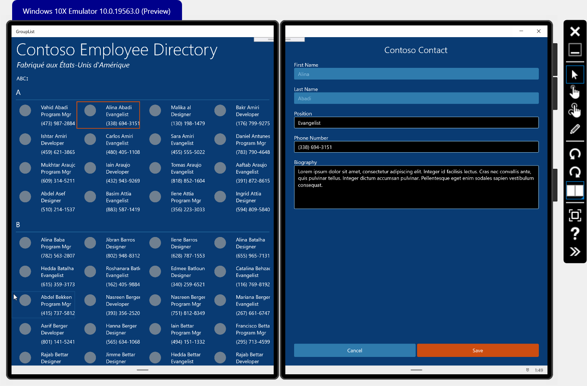

# TwoPaneGroupInfoList

## Windows Developer Incubation and Learning - Paula Scholz

## Introduction



A Universal Windows Platform sample that illustrates the [TwoPaneView](https://docs.microsoft.com/en-us/windows/uwp/design/controls-and-patterns/two-pane-view) layout control for [Dual-Screen experiences](https://docs.microsoft.com/en-us/dual-screen/introduction), using a randomly-generated Contact list presented in groups with the [SemanticZoom](https://docs.microsoft.com/en-us/windows/uwp/design/controls-and-patterns/semantic-zoom) control.

[TwoPaneView](https://docs.microsoft.com/en-us/windows/uwp/design/controls-and-patterns/two-pane-view) provides two distinct areas of content that can be spanned onto separate screens on dual-screen devices like the [Surface Neo](https://www.microsoft.com/en-us/surface/devices/surface-neo?&OCID=AID2000022_SEM_oCeJqLSf&msclkid=41672d2d892e1554df52734a51ae580b). `TwoPaneView` is the primary layout panel used to support dual-screen development for UWP applications.

While `TwoPaneView` is part of the Windows SDK, Microsoft recommends you use the version inside the [Windows UI](https://docs.microsoft.com/en-us/uwp/toolkits/winui/) library, which provides updated versions of existing Windows platform controls.

## System Requirements

At the time of writing (March, 2020), development for dual-screen experiences requires a [Windows Insider Preview Build](https://docs.microsoft.com/en-us/windows-insider/at-home/get-started). This demo uses [Windows 10 Insider Preview Build 19559](https://blogs.windows.com/windowsexperience/2020/02/05/announcing-windows-10-insider-preview-build-19559/), its companion `Windows SDK`, and `Windows UI` version 2.4.0-prerelease-200203002 or better, available for installation through NuGet. Check on the [Windows Insider Flight Hub](https://docs.microsoft.com/en-us/windows-insider/flight-hub/) for the latest OS and SDK downloads. You must be a member of the [Windows Insider Program](https://insider.windows.com/en-us/) to obtain access to these assets.

## Development Tools

You will need the latest [Visual Studio 2019 Preview](https://visualstudio.microsoft.com/vs/preview/), which can run right alongside your existing Visual Studio installations. This sample was built with Visual Studio 2019 Preview 5.

Lastly, you will need the [Microsoft Emulator with the Windows 10x Emulator Image Preview](https://docs.microsoft.com/en-us/dual-screen/windows/get-dev-tools) from the Microsoft Store, so that you may run this sample without an actual dual-screen device. These tools must be installed on a Windows Insider OS build, along with the appropiate Windows SDK. 

## Using the Windows UI Library

To use the Windows UI library inside your dual-screen application, you must first install it from NuGet.  Right-click on your project file in the Visual Studio Solution Explorer to launch the NuGet tool.


Make sure you include the prerelease packages by selecting the checkbox.  You will need version 2.4.0-prerelease.20203002 or better.


Then, to use Windows UI Library controls rather than SDK controls, you will need to place a XamlControlsResources reference in your `App.xaml` Resource Dictionary, like this:

```xaml
<Application
    x:Class="GroupList.App"
    xmlns="http://schemas.microsoft.com/winfx/2006/xaml/presentation"
    xmlns:x="http://schemas.microsoft.com/winfx/2006/xaml"
    xmlns:local="using:GroupList"
    RequestedTheme="Dark">

    <!-- To use WinUI controls rather than SDK controls, you have to place a XamlControlsResources
         reference in your Resource Dictionary.  -->
    <Application.Resources>
        <ResourceDictionary>
            <ResourceDictionary.MergedDictionaries>
                <XamlControlsResources xmlns="using:Microsoft.UI.Xaml.Controls" />
                <ResourceDictionary Source="/Styles/_Colors.xaml"/>
                <ResourceDictionary Source="/Styles/_FontSizes.xaml"/>
                <ResourceDictionary Source="/Styles/_Thickness.xaml"/>
                <ResourceDictionary Source="/Styles/Irene.xaml" />
                <ResourceDictionary Source="/Styles/TextBlock.xaml"/>
                <ResourceDictionary Source="/Styles/Page.xaml"/>
            </ResourceDictionary.MergedDictionaries>
        </ResourceDictionary>
    </Application.Resources>

</Application>
```


