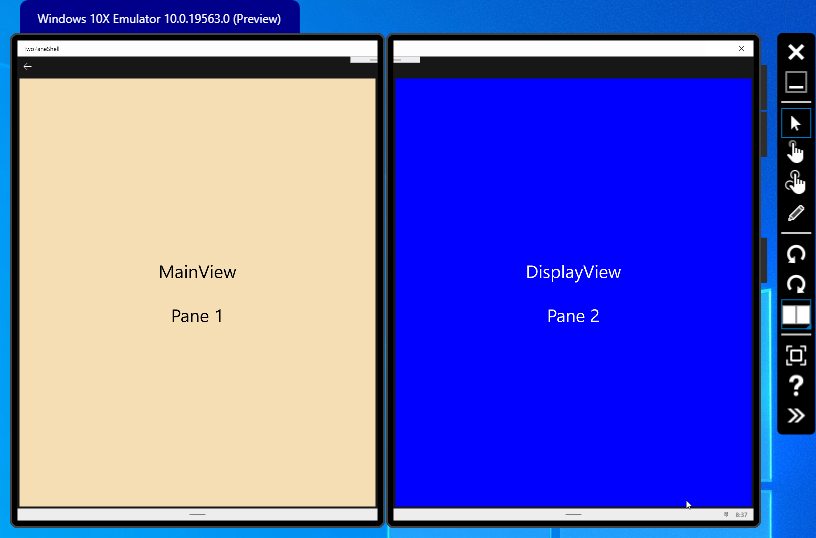

# TwoPaneGroupInfoList

## Windows Developer Incubation and Learning - Paula Scholz

## Introduction


A Universal Windows Platform sample that illustrates the [TwoPaneView](https://docs.microsoft.com/en-us/windows/uwp/design/controls-and-patterns/two-pane-view) layout control for [Dual-Screen experiences](https://docs.microsoft.com/en-us/dual-screen/introduction), using a randomly-generated Contact list presented in groups with the [SemanticZoom](https://docs.microsoft.com/en-us/windows/uwp/design/controls-and-patterns/semantic-zoom) control.

[TwoPaneView](https://docs.microsoft.com/en-us/windows/uwp/design/controls-and-patterns/two-pane-view) provides two distinct areas of content that can be spanned onto separate screens on dual-screen devices like the [Surface Neo](https://www.microsoft.com/en-us/surface/devices/surface-neo?&OCID=AID2000022_SEM_oCeJqLSf&msclkid=41672d2d892e1554df52734a51ae580b). `TwoPaneView` is the primary layout panel used to support dual-screen development for UWP applications.

While `TwoPaneView` is part of the Windows SDK, Microsoft recommends you use the version inside the [Windows UI](https://docs.microsoft.com/en-us/uwp/toolkits/winui/) library, which provides updated versions of existing Windows platform controls.

## System Requirements

At the time of writing (March, 2020), development for dual-screen experiences requires a [Windows Insider Preview Build](https://docs.microsoft.com/en-us/windows-insider/at-home/get-started). This demo uses [Windows 10 Insider Preview Build 19559](https://blogs.windows.com/windowsexperience/2020/02/05/announcing-windows-10-insider-preview-build-19559/), its companion `Windows SDK`, and `Windows UI` version 2.4.0-prerelease-200203002 or better, available for installation through NuGet. Check on the [Windows Insider Flight Hub](https://docs.microsoft.com/en-us/windows-insider/flight-hub/) for the latest OS and SDK downloads. You must be a member of the [Windows Insider Program](https://insider.windows.com/en-us/) to obtain access to these assets.

## Development Tools

You will need the latest [Visual Studio 2019 Preview](https://visualstudio.microsoft.com/vs/preview/), which can run right alongside your existing Visual Studio installations. This sample was built with Visual Studio 2019 Preview 5.

Lastly, you will need the [Microsoft Emulator with the Windows 10x Emulator Image Preview](https://docs.microsoft.com/en-us/dual-screen/windows/get-dev-tools) from the Microsoft Store, so that you may run this sample without an actual dual-screen device. These tools must be installed on a Windows Insider OS build, along with the appropiate Windows SDK. 

## Using the Windows UI Library

To use the Windows UI library inside your dual-screen application, you must first install it from NuGet.  Right-click on your project file in the Visual Studio Solution Explorer to launch the NuGet tool.


Make sure you include the prerelease packages by selecting the checkbox.  You will need version 2.4.0-prerelease.20203002 or better.


Then, to use Windows UI Library controls rather than SDK controls, you will need to place a XamlControlsResources reference in your `App.xaml` Resource Dictionary, like this:

```xaml
<Application
    x:Class="GroupList.App"
    xmlns="http://schemas.microsoft.com/winfx/2006/xaml/presentation"
    xmlns:x="http://schemas.microsoft.com/winfx/2006/xaml"
    xmlns:local="using:GroupList"
    RequestedTheme="Dark">

    <!-- To use WinUI controls rather than SDK controls, you have to place a XamlControlsResources
         reference in your Resource Dictionary.  -->
    <Application.Resources>
        <ResourceDictionary>
            <ResourceDictionary.MergedDictionaries>
                <XamlControlsResources xmlns="using:Microsoft.UI.Xaml.Controls" />
                <ResourceDictionary Source="/Styles/_Colors.xaml"/>
                <ResourceDictionary Source="/Styles/_FontSizes.xaml"/>
                <ResourceDictionary Source="/Styles/_Thickness.xaml"/>
                <ResourceDictionary Source="/Styles/Irene.xaml" />
                <ResourceDictionary Source="/Styles/TextBlock.xaml"/>
                <ResourceDictionary Source="/Styles/Page.xaml"/>
            </ResourceDictionary.MergedDictionaries>
        </ResourceDictionary>
    </Application.Resources>

</Application>
```
## Configuring your Emulator

You may need to configure your Win10x Emulator image.  To do this, launch the `Microsoft Emulator Manager` application from the Start menu. You will see a screen that looks like this:


Once you have started the emulator image by pressing the Start button, the emulator will launch and you will see a Progress Ring as the Win10x OS image loads.  If the Progress Ring stops and the emulator freezes, you will have to disable the GPU, as some desktop GPUs are not compatible with the emulator.  To to this, click the Edit button on the image entry in the Emulator Manager and you will see a screen that looks like this:


Simply click the `Disable GPU` checkbox and press the Save button.  Then, restart your emulator image.

Note the IP address of the running emulator image, shown in the Emulator Manager.  You will need this when you configure the debug options for your project in Visual Studio, like this:


To get to this screen, simply right-click on your project file in the Visual Studio Solution Explorer and select Properties.  This will launch the project property window.  Select the Debug tab and enter the IP address of your emulator image into the Remote Machine textbox.  Then, in the Authentication Mode drop-down, select `Universal (Unencrypted Protocol)`.  You may then select Remote Machine as your debug target and the application will launch into the emulator when you press F5.

## Visual Studio Solution

The Visual Studio Solution is shown below:


`MainPage.xaml` contains the single Page and `TwoPaneView` control and serves as the core of the project.  

Inside each pane are UserControls, one for displaying the generated Contacts list on the `MainView` pane (Pane1), called `GroupedListView`, and another for the Contact edit form, hosted on the `DisplayView` pane (Pane2). These UserControls are implemented in `GroupedListView.xaml` and `DisplayView.xaml`, along with their respective code-behind files.

In the `Contact.cs` file we generate both the Contact list and its respective alphabetical groups used to populate a `CollectionViewSource` object bound to an `ObservableCollection<GroupInfoList>` in `GroupedListView`.

In the `GroupList` folder we have two classes used to support the [SemanticZoom](https://docs.microsoft.com/en-us/windows/uwp/design/controls-and-patterns/semantic-zoom) control in `GroupedListView` which provides an index to the alphabetic groups of the Contact list.

## TwoPaneView

The primary display layout panel for our application is [TwoPaneView](https://docs.microsoft.com/en-us/windows/uwp/design/controls-and-patterns/two-pane-view). This control provides separate display surfaces for each screen when the application is `spanned` across screens, and when the application is hosted on a single screen, as it does at application launch, its `PanePriority` and `Mode` properties are used to determine which Pane is displayed on the single screen.



The `MainView` Pane1 contains the `GroupedInfoList` UserControl and the `DisplayView` Pane2 contains the Contact edit form UserControl.

`MainPage.xaml` is the single Page in our solution and looks like this:

```xaml
<Page
    x:Class="GroupList.MainPage"
    xmlns="http://schemas.microsoft.com/winfx/2006/xaml/presentation"
    xmlns:x="http://schemas.microsoft.com/winfx/2006/xaml"
    xmlns:local="using:GroupList.GroupList"
    xmlns:contact="using:GroupList"
    xmlns:d="http://schemas.microsoft.com/expression/blend/2008"
    xmlns:mc="http://schemas.openxmlformats.org/markup-compatibility/2006"
    xmlns:controls="using:Microsoft.UI.Xaml.Controls"
    mc:Ignorable="d"
    Background="{ThemeResource ApplicationPageBackgroundThemeBrush}">

    <Grid Background="{ThemeResource SystemControlPageBackgroundChromeLowBrush}">
        <Grid.RowDefinitions>
            <RowDefinition Height="Auto"/>
            <RowDefinition Height="*"/>
        </Grid.RowDefinitions>
        
        <!-- This is the BackButton -->
        <Button Style="{StaticResource NavigationBackButtonNormalStyle}" x:Name="BackButton" Click="BackButton_Click" 
                IsEnabled="False" Visibility="{x:Bind ApplicationNotSpanned, Mode=OneWay}"/>
        
        <!-- TwoPaneView allows screen spanning and display of panes under software control.  Here, we use UserControls
              to host the actual content of the panes.    -->
        <controls:TwoPaneView x:Name="MainView"
                 Grid.Row="1"
                 Pane1Length="1*"
                 Pane2Length="0*"
                 PanePriority="Pane1"
                 MinTallModeHeight="641"
                 MinWideModeWidth="641"
                 TallModeConfiguration="TopBottom"
                 WideModeConfiguration="LeftRight">
            <controls:TwoPaneView.Pane1>
                <local:GroupedListView />
            </controls:TwoPaneView.Pane1>
            <controls:TwoPaneView.Pane2>
                <contact:DisplayView />
            </controls:TwoPaneView.Pane2>
        </controls:TwoPaneView>
    </Grid>
</Page>
```
This Xaml sets up a two-row `Grid`.  The first row contains a navigation back button, active when Pane 2 (DisplayView) is the dominant pane and the display is not spanned (single-screen).  The second row contains our [TwoPaneView](https://docs.microsoft.com/en-us/uwp/api/microsoft.ui.xaml.controls.twopaneview?view=winui-2.4) control.

Note that each pane of the `TwoPaneView` is populated solely by a `UserControl`.  In Pane1, we have the `GroupedListView` used to create and display `Contact` objects in a `GridView`, and in Pane2 we have a Contact edit form used to display and edit individual Contact records.  Contact changes are not persisted to the Contact list as this is beyond the scope of the sample and the Contacts are generated randomly each time the application runs.

We need to handle several application states inside `MainPage.xaml.cs` to reflect orientation changes and respond to user events.  These take place in the `MainPage_SizedChanged` event handler, which is fired when rotation or application spanning occurs.  Let's examine this method:

```csharp
        /// <summary>
        /// Fired when a rotation or spanning occurs. Dual-Screen experience windows
        /// are either maximized or minimized, there is no intermediate position.
        /// </summary>
        /// <param name="sender"></param>
        /// <param name="e"></param>
        private void MainPage_SizeChanged(object sender, SizeChangedEventArgs e)
        {           
           
            switch(ApplicationView.GetForCurrentView().ViewMode)
            {
                case ApplicationViewMode.Spanning:
                    //
                    Debug.WriteLine("MainPage_SizeChanged View Mode is ApplicationViewMode.Spanning");
                    ApplicationIsSpanned = !ApplicationIsSpanned;
                    break;
                case ApplicationViewMode.Default:
                    //
                    Debug.WriteLine("MainPage_SizeChanged View Mode is ApplicationViewMode.Default");
                    ApplicationIsSpanned = false;
                    break;
                case ApplicationViewMode.CompactOverlay:
                    //
                    Debug.WriteLine("MainPage_SizeChanged View Mode is ApplicationViewMode.CompactOverlay");
                    break;
                default:
                    //
                    break;
            }

            if (GroupedListView.Current.SelectedContact != null)
            {
                // set the current contact in the display view
                DisplayView.Current.SetCurrentContact(GroupedListView.Current.SelectedContact);
            }

            // if we're spanned and we have a current contact
            // if the application is spanned, it doesn't matter what the Pane1Length or Pane2Length is
            if (ApplicationIsSpanned && GroupedListView.Current.SelectedContact != null)
            {
                // set the flag so we know we were spanned
                applicationWasSpanned = true;
            }
            else if (!ApplicationIsSpanned && GroupedListView.Current.SelectedContact != null)  // not spanned and have a current contact
            {
                // if we were spanned and are now not
                if(applicationWasSpanned)
                {
                    // We want to see the DisplayView dominant
                    SetDisplayViewDominant();

                    applicationWasSpanned = false;
                }
                else if (CurrentDominantView == DominantView.Main)
                {
                    // if we weren't spanned, and still are not, set GroupInfoList dominant
                    SetMainViewDominant();
                } 
                else
                {
                    // set the DisplayView Contact edit form dominant
                    SetDisplayViewDominant();
                }
            }
        }
        
```
The first thing is to check the spanned status of the application.  We do this by examing the `ApplicationViewMode` value of the current`ApplicationView`. Note that you need to be using the preview `WinUI` library to have the `Spanning` enum value.

There is no way to query the actual application spanned status, instead we know the application starts in an unspanned default mode and we keep track of changes through our `ApplicationIsSpanned` boolean property each time `MainPage_SizeChanged` is fired.

Then, if we have a currently selected contact in the `GroupedListView`, we call the `DisplayView.Current.SetCurrentContact` method, which will change the `TwoPaneView.WideModeConfiguration` and `TwoPaneView.TallModeConfiguration` to `LeftRight` and `TopBotton`, by calling `MainPage.SetDualPanes()` through the static `Current` instance variable.

```csharp
        /// <summary>
        /// Set us up as single-pane and enable the back button.
        /// </summary>
        public void SetMainViewDominant()
        {
            MainView.Pane1Length = OneStarGridLength;
            MainView.Pane2Length = ZeroStarGridLength;
            MainView.PanePriority = MUXC.TwoPaneViewPriority.Pane1;
            MainView.WideModeConfiguration = MUXC.TwoPaneViewWideModeConfiguration.SinglePane;
            MainView.TallModeConfiguration = MUXC.TwoPaneViewTallModeConfiguration.SinglePane;
            CurrentDominantView = DominantView.Main;

            BackButton.IsEnabled = false;
        }

        /// <summary>
        /// Set up as spanned across screens.
        /// </summary>
        public void SetDualPanes()
        {
            MainView.WideModeConfiguration = MUXC.TwoPaneViewWideModeConfiguration.LeftRight;
            MainView.TallModeConfiguration = MUXC.TwoPaneViewTallModeConfiguration.TopBottom;
        }

        /// <summary>
        /// Set the Contact Edit form dominant on a single screen and enable the back button.
        /// </summary>
        public void SetDisplayViewDominant()
        {
            MainView.Pane1Length = ZeroStarGridLength;
            MainView.Pane2Length = OneStarGridLength;
            MainView.PanePriority = MUXC.TwoPaneViewPriority.Pane2;
            CurrentDominantView = DominantView.Display;
            MainView.WideModeConfiguration = MUXC.TwoPaneViewWideModeConfiguration.LeftRight;
            MainView.TallModeConfiguration = MUXC.TwoPaneViewTallModeConfiguration.TopBottom;

            BackButton.IsEnabled = true;
        }

        /// <summary>
        /// User pressed the BackButton, so change the dominant pane to the contact list.
        /// </summary>
        /// <param name="sender"></param>
        /// <param name="e"></param>
        private void BackButton_Click(object sender, RoutedEventArgs e)
        {
            SetMainViewDominant();
        }
```
If our application is in a Spanned state, we want to display both panes.  If we have a current contact, the Contact edit form will be displayed in Pane 2 on `DisplayView.xmal` and if we do not, then the `GridView` containing the Contact list will be displayed on both panes and both the `WideModeConfiguration` and `TallModeConfiguration` of the `MainView` will be set to a `SinglePane` configuration.

## GroupedInfoList and SemanticZoom

The Contact list created in GroupInfoList is assigned to a [CollectionViewSource](https://docs.microsoft.com/en-us/uwp/api/Windows.UI.Xaml.Data.CollectionViewSource) that provides grouping and current-item support to its assigned `ObservableCollection`.  

Inside the `Documentation` folder of this repository, you will find a `semanticzoom_web.htm` file that provides a comprehensive explanation of the `Contact`, `GroupInfoList`, `EmptyOrFullSelector` and `GroupedListView` classes.  You may also view this [documentation](https://swifter.github.io/GroupInfoList/semanticzoom_web.htm) online at my personal GitHub repository.


